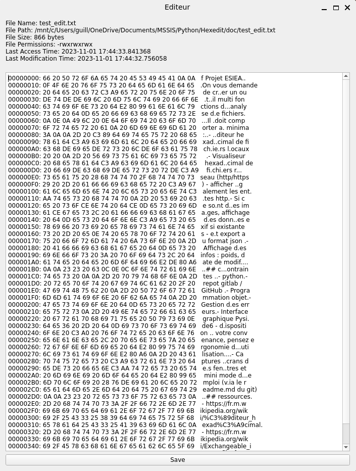
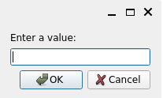
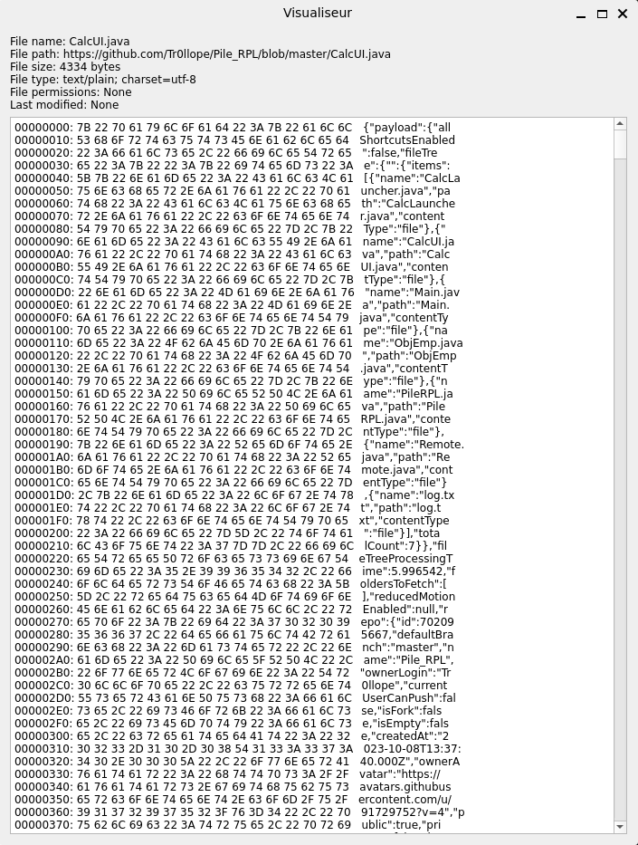

# Hexedit
Ce programme est un éditeur hexadécimal de fichiers. Il permet de modifier toute sorte de fichiers grâce à un interface graphique réalisé avec la librairie PySide6.

## Installation:
Une fois le projet cloné, il faut créer un environnement virtuel python3 et installer les dépendances du projet.
```
python3 -m venv venv
source venv/bin/activate
pip install -r requirements.txt
```

Les librairies PySide6, requests et pillow sont nécessaires pour l'exécution du programme. Elles sont installées automatiquement lors de l'installation des dépendances. Cependant, si vous rencontrez des problèmes lors de l'installation, vous pouvez les installer manuellement avec les commandes suivantes:
```
pip install PySide6
pip install requests
pip install pillow
```

## Exécution:
Pour exécuter le programme, il faut lancer le script `Launcher.py` avec python3.
```
python3 Launcher.py
```

## Utilisation:
Lors de l'exécution, la fenêtre suivante s'ouvre:  
  
On y retrouve deux boutons:  
- Edit, qui permet d'éditer un fichier local
- Visualize, qui permet de visualiser un fichier distant

Dans le cas où le fichier est une image, le programme affiche les données exif dans la fenêtre de visualisation et les exporte au format json, si elles existent.

### Mode Edition
Dans un premier temps, il faut sélectionner le fichier à éditer via le navigateur de fichier qui se présente de la manière suivante:  
  

Une fois le fichier sélectionné, la fenêtre d'édition s'ouvre:
  
On y retrouve les informations du fichier, ainsi que son contenu en hexadécimal.
Une fois les modifications effectuées, il faut cliquer sur le bouton `Save` pour enregistrer les modifications.  
Si le fichier est modifié, un message de confirmation s'affiche en bas de la fenêtre d'édition. 
Vous pouvez terminer l'édition en fermant la fenêtre.  

### Mode Visualisation
Ici, vous devez renseigner l'url du fichier à visualiser.  
  
Si le fichier est valide, il s'affiche dans la fenêtre de visualisation:  
  
Vous remarquerez que l'apparence de la fenêtre de visualisation est la même que celle de la fenêtre d'édition. Seulement, aucune modification n'est permise.
