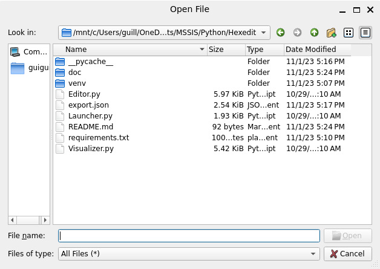

# Hexedit
Ce programme est un éditeur hexadécimal de fichiers. Il permet de modifier toute sorte de fichiers grâce à un interface graphique réalisé avec la librairie PySide6.

lib: PySide6, requests, pillow

## Utilisation:
Lors de l'exécution, la fenêtre suivante s'ouvre:  
  
On y retrouve deux boutons:  
- Edit, qui permet d'éditer un fichier local
- VIsualize, qui permet de visualiser un fichier distant

### Mode Edition

## Mode Visualisation
